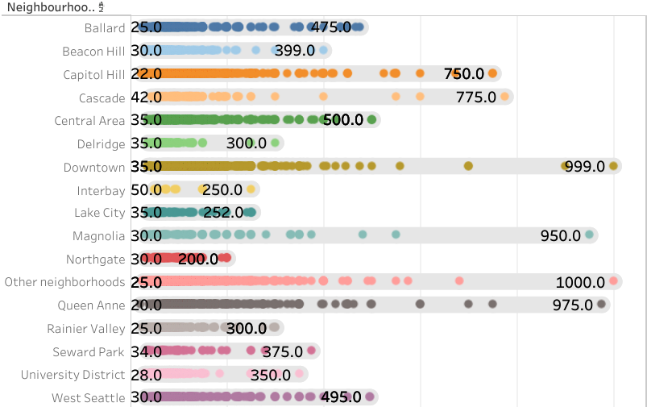
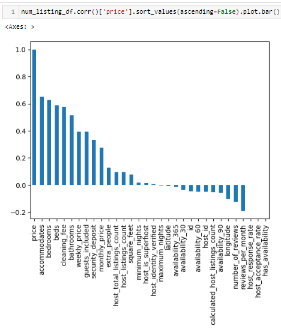
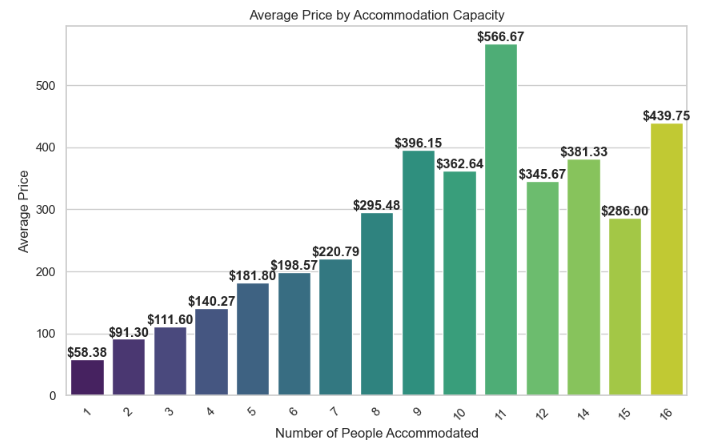

# Creating-the-Best-Airbnb-in-Seattle
[interactive visualization tool](https://public.tableau.com/app/profile/nahyy4315/viz/CuratingthebestairbnbinSeattle/Geospatialanalysis)
(please hover over the parts of the viz which might not be displaying properly due to versioning incompatibilities)

## Introduction
Running an Airbnb has always fascinated me, and Seattle's vibrant atmosphere and proximity to nature further piqued my interest. This led to the motivation behind this project: to gain a comprehensive understanding of the Airbnb market in the city. The primary objective of this data analytics project is to analyze the Airbnb market in Seattle and provide valuable insights for potential hosts and travelers.

The project will leverage data from Airbnb listings, along with external datasets, to create an [interactive visualization tool](https://public.tableau.com/app/profile/nahyy4315/viz/CuratingthebestairbnbinSeattle/Geospatialanalysis) that offers insights into the following aspects of Airbnb rentals in Seattle:

1. Neighbourhoods
2. Attractions
3. External Market Conditions
4. Amenities

The resulting interactive visualization will serve as a valuable tool for both current and potential Airbnb hosts, as well as travelers looking for the best accommodation options in Seattle

Additionally, a sentiment analysis segement to analyze guest experience through text mining of guest reviews has been conducted to understand the factors affecting the overall guest experience.

## Data
- AirBnB data was sourced from [Kaggle](https://www.kaggle.com/datasets/airbnb/seattle)
- Data on all attractions in Seattle was extracted with the Foursquare API
- CPI data was sourced from [Federal Reserve Economic Data (FRED)](https://fred.stlouisfed.org/)

## Neighbourhood Analysis
The objective of this dashboard was to provide a comprehensive yet broad overview into different neighbourhoods in Seattle. 

Dashboard Demo:

The first revelation is that neighbourhoods that with above median prices are typically on the western side of Seattle. On the other hand, the cheaper neighbourhoods are on the innerside of the city . 

    
    

Next, investigations will delve deeper into the behaviour of the market across time. Excluding 2016 due to the lack of data, between 2014 to 2015 it seems like every neighbourhood has been experiencing falling prices along with an increase in quantity listings except for Magnolia, Beacon Hill, Lake City and Other Neighbourhoods. 

Since Other Neighbourhoods is a catchall term for listings in neighbourhoods "not recognised" by Airbnb, it is not suprising to be amongst the few cities with the largest variance. However, Magnolia is a "recognised city" like Beacon Hill, Lake City so it is worthwhile invesitgating why the variances  is so large in Magnolia.

Lastly, based on the the dashboard, reasonable prices to charge is between $72 to $150, depending on the neighbourhood. However, since this is more than 100% higher than the lower bound charged across all neighbourhoods as seen below, further research was conducted to understand the reason behind the drastic price differences.

A correlation test against price was conducted. It shows that the number of people a listing accomodates is highly correlated with price. Digging deeper to understand how the number of people a listing accomodates, we see that the average price peaks when there are 11 people to accomodate and dips at 15.

    
    

## Geospatial Analysis:
Attractions data extracted from the Foursquare API included other insightful information like:  
| Field       | Description                                                                                                             |
|-------------|-------------------------------------------------------------------------------------------------------------------------|
| rating      | A numerical rating (from 0.0 to 10.0) of the FSQ Place, based on user votes, likes/dislikes, tips sentiment, and visit data. Not all FSQ Places will have a rating. |
| popularity  | Measure of the FSQ Place's popularity, by foot traffic. This score is on a 0 to 1 scale and uses a 6-month span of POI visits for a given geographic area.   |
| price       | A numerical value (from 1 to 4) that best describes the pricing tier of the FSQ Place, based on known prices for menu items and other offerings. Values include: 1 = Cheap, 2 = Moderate, 3 = Expensive, and 4 = Very Expensive. |

After ranking the neighbourhoods according to respective attraction data based on average rating, popularity and price, it can be seen that attractions in Downtown, Capitol Hill and Ballard dominates accross all boards on popularity, rating and priciest neighbourhoods. Whereas the opposite would be said for attractions in Interbay and Cascade.  

Based on prior travelling experience, a dissapointing situation as a tourist was when an attraction is one where popularity was higher than actual ratings and price was high. I engineered a new feature to capture this situation by taking the difference of popularity and rating for each attraction. Since dissapointment is also a product of price, this difference is also multiplied by the Price. After data preparation like min max scaling and replacing the 0s in price with 1, now we can clearly see the neighbourhoods with a concentration of dissapointing attractions being Downtown, Capitol Hill and Ballard.

## Competitor Analysis
This segment of the analysis concerns external market conditions, the relationship between CPI and listing prices, property ownership in Seattle's neighborhoods and the impact of time in terms of age and demand.

Dashboard Demo:

The relationship between age and listing prices was determined with Autocorrelation Function (ACF) after outliers in prices were removed and the data is smoothed with low pass filters. The ACF plot does show a positive correlation between the prices at different lags. This suggests that the prices tend to be similar over time. This may be due to a number of factors, such as the fact that Airbnb listings are often priced based on the same factors, such as the location and amenities of the listing.

The relationship between CPI and listing prices was determined by the correlation coefficient between Airbnb listing prices and CPI data: 0.009861794181379615. This indicates a very weak linear relationship. That said, a correlation coefficient near 0 does not imply that there is no relationship between the variables; but that the relationship is not well-explained by a linear model. Other complex relationships or factors at play could be missed by the correlation coefficient alone.

Concentration of property ownership in Seattle's neighborhoods impacts Airbnb operations in several ways: by influencing property supply and competition, which directly affects profitability. Additionally, the significant presence of Airbnb businesses may reduce available long-term rental units, unlocking a new market with alternative pricing strategies to explore. 

The dashboard was created by implementing calculated fields in the scorecard and set actions to link the table to the scorecard. This allows the user to interact with the neighbourhood in the table to see the percentage of hosts with more than 10 listings (within Seattle) to their names and the proportion of listings in the neighbourhood that they collectively own. The insight gleaned from this is that the concentration of ownership is the highest in University District. 7.81% of hosts in University District own more than 10 listings. In total, the listings they own make up 45% of listings within University District.

Apart from concentration affecting the supply of AirBnBs in the market, the question of when is the best time to operate an AirBnB came to mind. To determine this, the change in price and number of listings depending on month will be considered. As seen below, listing prices rise significantly from June to September, explainable by the fact that there are less listings available for reservation in summer. There is also a rise in December which shows that people often visit during winter holidays too, although the increase in price is not as large as 70% of listings are on average available in December.

    
    

Lastly, the dashboard also makes use of the simple linear regression model feature in Tableau to check for the significance in relationship between price and age of listings in month for different property types. Results for the apartment property type are as detailed: 
    1. the R-squared is approximately 0.0006662, which is a very low value, It suggests that there is a weak or almost negligible linear relationship as changes in the number of months between first and last listings do not lead to significant changes in the price of listings.
    2. the model's predictions may not be very precise as, predicted prices from the regression model deviate from the actual prices by around 78.785 units. 
    3. p-value less than 0.0001 indicates that the results are statistically significant at a very high level of confidence. 
    While the low p-value indicates that there is a statistically significant relationship between months and price, the extremely low R-squared value suggests that this relationship is practically insignificant. In other words, while the model shows that there is a statistical association between months and price, this association is so weak that it has very little practical relevance or explanatory power.  

## Amenities Analysis:

Dashboard Demo:

The objective of the amenitites dashboard was to identify the amenities that are most frequently offered, detect patterns in ammenities offered, highlight those that people are willing to pay for and understand roughly how much more it is that they are willing to pay.

The dashboard makes use of market basket analysis to identify the amenities that are most frequently offered and detect ammenities often offered in conjuction. This visualization makes use of sets, calculated fields and association rules.

To identify the amenities that people are willing to pay for, a Chi Square test was conducted. As seen below, kitchen, pool, tv, doorman, heating and gym are ammenities with the highest Chi Square result and p-values. These ammenities seem to be offered in specific property types like how only condominiums have ammenities like doorman, pool and gym.

Knowing that property type influences the ammenities provided and prices, the dashboard makes use of proportional brushing, enabling the user to see the ammenities that contribute the highest to the median priced of the listings of their selected property type. 

<!-- Relationship between doorman - condos and safety? -->

## Conclusion and Recommendations:
...

