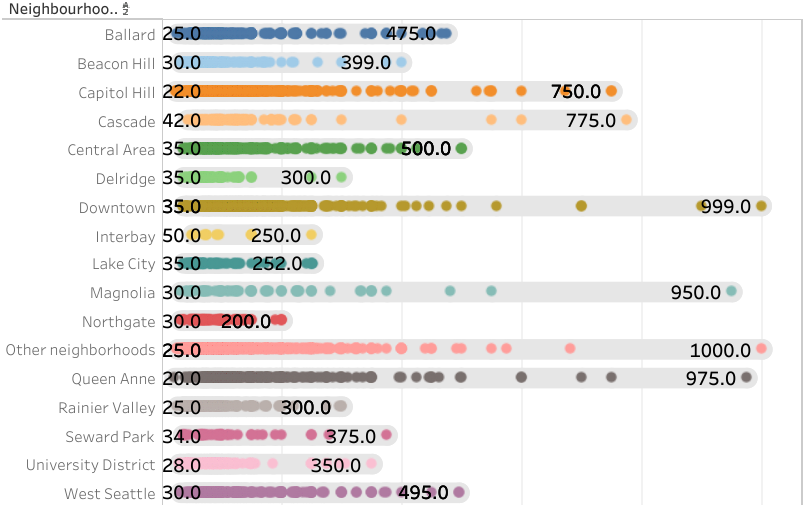
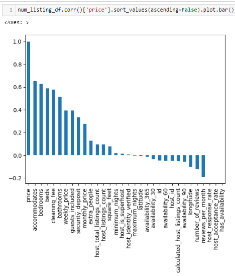
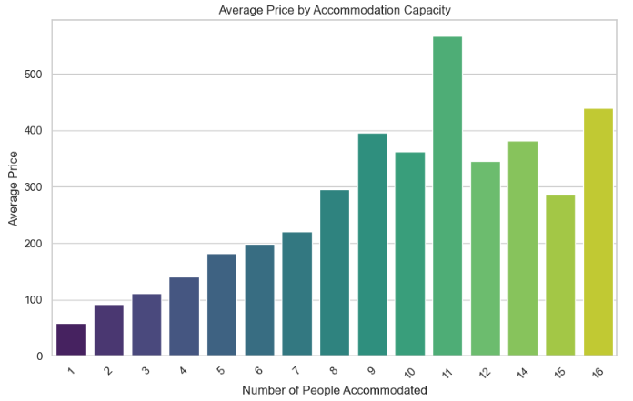

# Curating-the-Best-Airbnb-in-Seattle
Interactive Visualization : https://public.tableau.com/app/profile/nahyy4315/viz/CuratingthebestairbnbinSeattle/Geospatialanalysis 
(please hover over the parts of the viz which might not be displaying properly due to versioning incompatibilities)

## Introduction
Running an Airbnb has always fascinated me as a source of side income, and Seattle's vibrant atmosphere and proximity to nature further piqued my interest. This led to the motivation behind this project: to gain a comprehensive understanding of the Airbnb market in the city. The primary objective of this data analytics project is to analyze the Airbnb market in Seattle and provide valuable insights for potential hosts and travelers.

The project will leverage data from Airbnb listings, along with external datasets, to create an [interactive visualization tool](https://public.tableau.com/app/profile/nahyy4315/viz/CuratingthebestairbnbinSeattle/Geospatialanalysis) that offers insights into the following aspects of Airbnb rentals in Seattle:

1. Neighbourhoods
2. Attractions
3. External Market Conditions
4. Amenities

The resulting interactive visualization will serve as a valuable tool for both current and potential Airbnb hosts, as well as travelers looking for the best accommodation options in Seattle

Additionally, a sentiment analysis segement to analyze guest experience through text mining of guest reviews has been conducted to understand the factors affecting the overall guest experience.

## Data
- AirBnB data was sourced from [Kaggle](https://www.kaggle.com/datasets/airbnb/seattle)
- Data on all attractions in Seattle was extracted with the Foursquare API
- CPI data was sourced from [Federal Reserve Economic Data (FRED)](https://fred.stlouisfed.org/)

## Neighbourhood Analysis
The objective of this dashboard was to provide a comprehensive yet broad overview into different neighbourhoods in Seattle. 

Dashboard Demo:

The first revelation is that neighbourhoods that with above median prices are typically on the western side of Seattle. On the other hand, the cheaper neighbourhoods are on the innerside of the city . 

    
    

Next, investigations will delve deeper into the behaviour of the market across time. Excluding 2016 due to the lack of data, between 2014 to 2015 it seems like every neighbourhood has been experiencing falling prices along with an increase in quantity listings except for Magnolia, Beacon Hill, Lake City and Other Neighbourhoods. 

Since Other Neighbourhoods is a catchall term for listings in neighbourhoods "not recognised" by Airbnb, it is not suprising to be amongst the few cities with the largest variance. However, Magnolia is a "recognised city" like Beacon Hill, Lake City so it is worthwhile invesitgating why the variances  is so large in Magnolia.

Lastly, based on the the dashboard, reasonable prices to charge is between $72 to $150, depending on the neighbourhood. However, since this is more than 100% higher than the lower bound charged across all neighbourhoods as seen below, further research was conducted to understand the reason behind the drastic price differences.

A correlation test against price was conducted. It shows that the number of people a listing accomodates is highly correlated with price. Digging deeper to understand how the number of people a listing accomodates, we see that the average price peaks when there are 11 people to accomodate and dips at 15.

    
    

## Geospatial Analysis:
The objective of this dashboard was to understand the relationships between attractions and listings in different neighbourhood. 

Dashboard Demo:

 - Downtown has the most number of attractions near its listings.
 - Neighbourhoods with a higher concentration of listings within 480m are Cascade, Downtown and University District. It may be interesting to note that within Cascade, there's a listing with 300 attractions within p-distance of 300m.
 - This visualization is a good tool to use as a benchmark to see how the location of a listing compares with other listings within a neighbourhood.

## Competitor Analysis

## Amenities Analysis:

## Conclusion and Recommendations:
...

