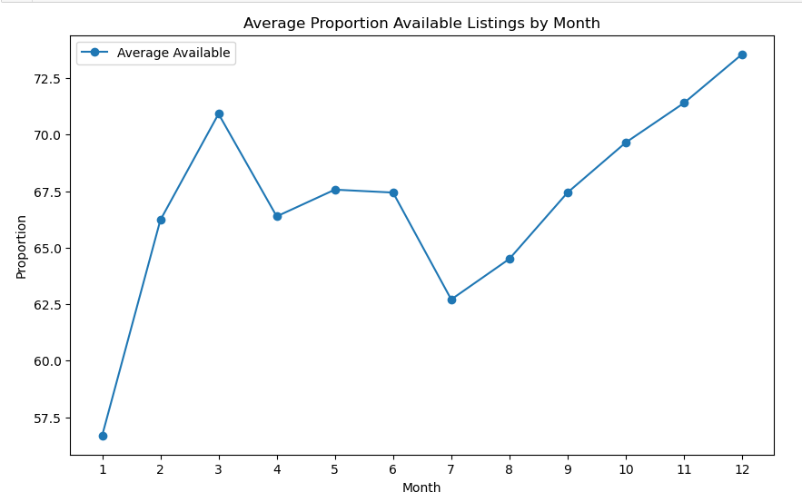

# Curating-the-Best-Airbnb-in-Seattle
Interactive Visualization : https://public.tableau.com/app/profile/nahyy4315/viz/CuratingthebestairbnbinSeattle/Geospatialanalysis (PLEASE hover over the parts of the viz which might not be displaying properly due to versioning incompatibilities 😩)

## Introduction
Running an Airbnb has always fascinated me as a source of side income, and Seattle's vibrant atmosphere and proximity to nature further piqued my interest. This led to the motivation behind this project: to gain a comprehensive understanding of the Airbnb market in the city. The primary objective of this data analytics project is to analyze the Airbnb market in Seattle and provide valuable insights for potential hosts and travelers.

The project will leverage data from Airbnb listings, along with external datasets, to create an [interactive visualization tool](https://public.tableau.com/app/profile/nahyy4315/viz/CuratingthebestairbnbinSeattle/Geospatialanalysis) that offers insights into the following aspects of Airbnb rentals in Seattle:

1. Neighbourhoods: Analyzing the distribution of listings across different neighborhoods and identifying popular areas for hosting.
2. Attractions: Identifying nearby attractions or points of interest that might impact listing demand and pricing.
3. External Market Conditions: Exploring external factors such as tourism events or economic conditions that could influence prices and occupancy rates.
4. Amenities: Examining the impact of amenities on listing prices and guest satisfaction.

The resulting interactive visualization will serve as a valuable tool for both current and potential Airbnb hosts, as well as travelers looking for the best accommodation options in Seattle

Additionally, a sentiment analysis segement to analyze guest experience through text mining of guest reviews has been conducted to understand the factors affecting the overall guest experience.

## Data
- AirBnB data was sourced from [Kaggle](https://www.kaggle.com/datasets/airbnb/seattle)
- Data on all attractions in Seattle was extracted with the Foursquare API
- CPI data was sourced from [Federal Reserve Economic Data (FRED)](https://fred.stlouisfed.org/)

## Neighbourhood Analysis

Which are the neighbourhoods with above median prices and among these

## Geospatial Analysis:
...

## Competitor Analysis
...

## Ammenities Analysis:
...

## Conclusion and Recommendations:
...

