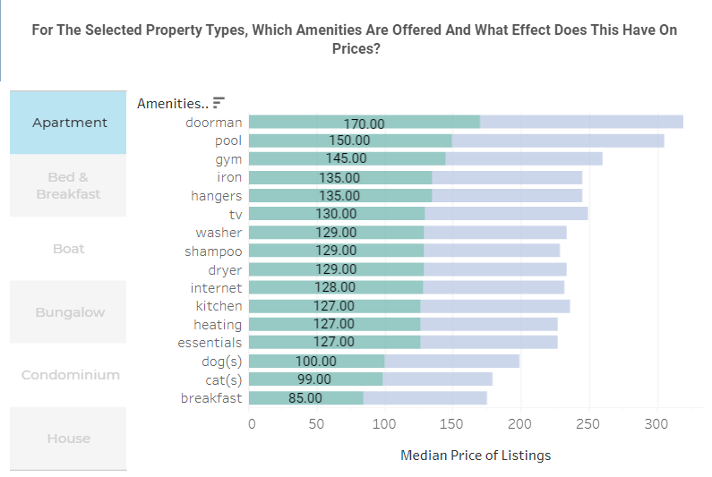

# Creating-the-Best-Airbnb-in-Seattle
[Interactive Dashboard](https://public.tableau.com/app/profile/nahyy4315/viz/CuratingthebestairbnbinSeattle/Geospatialanalysis)
(please hover over the parts of the viz which might not be displaying properly due to versioning incompatibilities)

## Contents Page
- [Introduction](#introduction)
  - [Data](#data)
- [Neighbourhood Analysis](#neighbourhood-analysis)
  - [Dashboard Demo](#dashboard-demo)
  - Dashboard Details & Analysis
    - Most Influential Factor Impacting Price
    - Relationship Between Most Influential Factor and Price
- [Geospatial Analysis](#geospatial-analysis)
  - [Dashboard Demo](#dashboard-demo-1)
  - Dashboard Details & Analysis
    - neighborhoods Ranked Based on Price, Rating, and Popularity Metrics in Foursquare
    - Disappointing Listings in Neighbourhoods
- [Competitor Analysis](#competitor-analysis)
  - [Dashboard Demo](#dashboard-demo-2)
  - Dashboard Details & Analysis
    - Relationship Between Age and Listing Prices with ACF
    - Relationship Between CPI and Listing Prices
    - Concentration of Property Ownership in Neighbourhoods
    - Best Time of the Year to Operate an Airbnb
- [Amenities Analysis](#amenities-analysis)
  - [Dashboard Demo](#dashboard-demo-3)
  - Dashboard Details & Analysis
    - Market Basket Analysis on Amenities Offered
    - Identify Amenities That People Are Willing to Pay for and How Much More They Will Pay
    - How Breakfast Offerings Affect Prices in neighborhoods with Many Attractions vs. Less Attractions
- [Conclusion and Recommendations](#conclusion-and-recommendations)
    - [Future Work](#future-work)

## Introduction
Running an Airbnb has always fascinated me, and Seattle's vibrant atmosphere and proximity to nature further piqued my interest. This led to the motivation behind this project: to gain a comprehensive understanding of the Airbnb market in the city. The primary objective of this data analytics project is to analyze the Airbnb market in Seattle and provide valuable insights for potential hosts and travelers.

The project will leverage data from Airbnb listings, along with external datasets, to create an [interactive visualization tool](https://public.tableau.com/app/profile/nahyy4315/viz/CuratingthebestairbnbinSeattle/Geospatialanalysis) that offers insights into the following aspects of Airbnb rentals in Seattle:

1. Neighborhoods
2. Attractions
3. External Market Conditions
4. Amenities

The resulting interactive visualization will serve as a valuable tool for both current and potential Airbnb hosts, as well as travelers looking for the best accommodation options in Seattle.

Additionally, a sentiment analysis segment to analyze guest experiences through text mining of guest reviews has been conducted to understand the factors affecting the overall guest experience.

### Data
- AirBnB data was sourced from [Kaggle](https://www.kaggle.com/datasets/airbnb/seattle)
- Data on all attractions in Seattle was extracted with the Foursquare API
- CPI data was sourced from [Federal Reserve Economic Data (FRED)](https://fred.stlouisfed.org/)

## Neighbourhood Analysis
The objective of this dashboard was to provide a comprehensive yet broad overview into different neighborhoods in Seattle. 

### Dashboard Demo:

The first revelation is that neighborhoods with above-median prices are typically on the western side of Seattle. On the other hand, the cheaper neighborhoods are on the inner side of the city.

    
    

Next, investigations will delve deeper into the behaviour of the market across time. Excluding 2016 due to the lack of data, between 2014 to 2015 it seems like every neighbourhood has been experiencing falling prices along with an increase in quantity listings except for Magnolia, Beacon Hill, Lake City and Other Neighbourhoods. 

Since Other Neighbourhoods is a catchall term for listings in neighbourhoods "not recognised" by Airbnb, it is not suprising to be amongst the few cities with the largest variance. However, Magnolia is a "recognised city" like Beacon Hill, Lake City so it is worthwhile invesitgating why the variances  is so large in Magnolia.

Lastly, based on the the dashboard, reasonable prices to charge are between $72 to $150, depending on the neighbourhood. However, since this is more than 100% higher than the lower bound of prices charged across all neighbourhoods as seen below, further research was conducted to understand the drastic price differences.

A correlation test against price was conducted. It shows that the number of people a listing accomodates is highly correlated with price.

Digging deeper to understand how the number of people a listing accomodates, we see that the average price peaks when there are 11 people to accomodate and dips at 15.

## Geospatial Analysis:
Attractions data extracted from the Foursquare API included other insightful information, such as:

| Field       | Description                                                                                                             |
|-------------|-------------------------------------------------------------------------------------------------------------------------|
| rating      | A numerical rating (from 0.0 to 10.0) of the FSQ Place, based on user votes, likes/dislikes, tips sentiment, and visit data. Not all FSQ Places will have a rating. |
| popularity  | Measure of the FSQ Place's popularity, by foot traffic. This score is on a 0 to 1 scale and uses a 6-month span of POI visits for a given geographic area.   |
| price       | A numerical value (from 1 to 4) that best describes the pricing tier of the FSQ Place, based on known prices for menu items and other offerings. Values include: 1 = Cheap, 2 = Moderate, 3 = Expensive, and 4 = Very Expensive. |

After ranking the neighborhoods according to their respective attraction data based on average rating, popularity, and price, it can be seen that attractions in Downtown, Capitol Hill, and Ballard dominate across all categories of popularity, rating, and pricing. On the contrary, this would not be the case for attractions in Interbay and Cascade.

Based on prior travel experiences, a disappointing situation as a tourist is when an attraction has higher popularity than actual ratings and a high price. To address this, I engineered a new feature to identify such situations by calculating the difference between popularity and rating for each attraction. Since disappointment is also influenced by price, this difference is further multiplied by the price. After data preparation, including min-max scaling and replacing the zeros in price with ones, we can now clearly identify the neighborhoods with a concentration of disappointing attractions, namely Downtown, Capitol Hill, and Ballard.

For geospatial analysis of attraction density of listings in neighbourhoods and to identify the types of highly rated attractions nearby, the below dashboard was created: 

For this visualization, a parameter for the radial distance was created (p-distance). I utilized various Tableau spatial functions (Buffer, MakePoint, Distance) as part of an interactive geospatial analysis to identify the number of Venues within p-distance, implementing spatial joins using join calculations, dynamic buffers with p-distance parameter, creating an in-range calculation to format venuew points within 1km as to be green.

## Competitor Analysis
This segment of the analysis addresses external market conditions, the relationship between CPI and listing prices, property ownership in Seattle's neighborhoods, and the impact of time in terms of age and demand.

### Dashboard Demo:

The relationship between age and listing prices was determined with Autocorrelation Function (ACF) after outliers in prices were removed and the data is smoothed with low pass filters. The ACF plot does show a positive correlation between the prices at different lags. This suggests that the prices tend to be similar over time. This may be due to a number of factors, such as the fact that Airbnb listings are often priced based on the same factors, such as the location and amenities of the listing.

The relationship between CPI and listing prices was assessed through the correlation coefficient between Airbnb listing prices and CPI data: 0.009861794181379615. This indicates a very weak linear relationship. However, a correlation coefficient near 0 does not necessarily imply no relationship between the variables; rather, it suggests that the relationship is not well-explained by a linear model. Other complex relationships or underlying factors might be overlooked by relying solely on the correlation coefficient.

Concentration of property ownership in Seattle's neighborhoods impacts Airbnb operations in several ways: by influencing property supply and competition, which directly affects profitability. Additionally, the significant presence of Airbnb businesses may reduce available long-term rental units, unlocking a new market with alternative pricing strategies to explore. 

The dashboard was created by incorporating calculated fields in the scorecard and implementing set actions to link the table to the scorecard. This allows users to interact with neighborhood data in the table and view the percentage of hosts with more than 10 listings within Seattle and the proportion of listings they collectively own. One of the insight gained from this reveals that the highest concentration of ownership is in the University District, with 7.81% of hosts owning more than 10 listings, accounting for 45% of the listings within the district.

Beyond affecting the supply of AirBnBs in the market, the question of the best time to operate an Airbnb arises. To determine this, changes in price and the number of available listings based on the month are considered. As shown below, listing prices rise notably from June to September, likely due to fewer available listings for summer reservations. There is also an increase in December, indicating that people often travel during winter holidays. However, the price increase is not as significant, as around 70% of listings on average are available in December.

    
    

Finally, the dashboard also utilizes the simple linear regression model feature in Tableau to assess the relationship between price and the age of listings by month for different property types. The results for the apartment property type are as follows:

1. The R-squared value is approximately 0.0006662, which is very low. This suggests a weak or almost negligible linear relationship, indicating that changes in the number of months between first and last listings do not lead to significant changes in listing prices.
2. The model's predictions may lack precision, with predicted prices from the regression model deviating by around 78.785 units from the actual prices.
3. A p-value of less than 0.0001 indicates that the results are statistically significant at a very high level of confidence.

While the low p-value indicates a statistically significant relationship between months and price, the extremely low R-squared value suggests that this relationship is practically insignificant. In other words, while the model demonstrates a statistical association between months and price, this association holds little practical relevance or explanatory power.

## Amenities Analysis:

### Dashboard Demo:

The objective of the amenities dashboard is to identify the most frequently offered amenities, detect patterns in amenities offered, highlight those for which guests are willing to pay, and understand the approximate premium they are willing to pay.

The dashboard utilizes market basket analysis to identify commonly offered amenities and detect frequently paired amenities. This visualization employs calculated fields, association rules, sets and set actions.

The figure below displays the top 2 most frequently offered amenities: kitchen (12.18%) and heating (12.82%), often present together within a listing.

To identify amenities that guests are willing to pay for, a Chi-Square test was conducted. As illustrated below, amenities such as kitchen, pool, TV, doorman, heating, and gym demonstrate the highest Chi-Square results and p-values. These amenities appear to be specific to certain property types; for example, only condominiums offer amenities like doorman, pool, and gym.  

 
For assessing the impact of amenities on the median price of a selected property type, the dashboard employs proportional brushing. Taking apartments as an example, the visualization below presents various amenities contributing to prices. Listings with doorman amenities command a median price of $170, while those with a pool have a median price of $150, and those with a gym have a median price of $145. These amenities are relatively rare and non-essential, indicative of more luxurious listings.

Conversely, apartments that offer breakfast have the lowest median prices at $85—an interesting point for further investigation. The distribution of breakfast offerings across neighborhoods and property types is depicted below. Breakfast is frequently offered in houses, predominantly in the Central area and Rainier Valley. Given the considerable disparity in the number of attractions between these neighborhoods, it is worth exploring how breakfast offerings impact prices.

    
    

To eliminate the effect of accommodation capacity on prices, prices are divided by the number of people the listing accommodates. The histogram below depicting price distribution shows that listings offering breakfast are cheaper in Rainier Valley compared to Capitol Hill, despite the latter having more attractions and breakfast places. This underscores the demand for breakfast as a value-added amenity, with guests willing to pay more for it. Conversely, breakfast is offered more frequently in lower-priced listings in Rainier Hill, where 8 listings offering breakfast are the cheapest. This likely occurs because breakfast is offered as a matter of convenience due to the lack of nearby attractions.  

## Conclusion and Recommendations

What neighborhoods to operate in? 

| Shortlisted Neighborhoods | Rationale | Prices to Charge |
|---------------------------|-----------|------------------------|
| Downtown         | Listing prices have been increasing since 2011. The Airbnb market has also been growing, with more people offering their places for rent. The presence of numerous attractions throughout the neighborhood makes it highly appealing to tourists. In terms of market saturation, there are fewer commercialized hosts, allowing differentiation through amenities like breakfast or reduced cleaning fees.	| Consider charging above a median price of around $150 during the summer and $100 during other seasons and lower for long term stays|
| West Seattle            | Similar to Downtown, listing prices and the quantity of listings have been rising since 2011. Although this neighborhood has fewer attractions, most of them are positively received and relate to natural settings. However, the density of attractions is comparatively lower. To stand out, offering amenities like breakfast or a well-stocked kitchen could be beneficial. In terms of market saturation, only 1 host in West Seattle owns more than 10 listings, which is relatively manageable compared to University District. | Consider charging above a median price of around $101 in the summer and $80 during other seasons and lower for long term stays, taking accommodation capacity into account as well. |
| Queen Anne            | Listing prices have fallen as the quantity of listings on the market increased. In terms of market saturation, only 2 hosts in Queen Anne own more than 10 listings, which is relatively manageable compared to University District. Additionally, 26 hosts own between 4 to 6 listings. The neighborhood offers a moderate density of attractions, ranging from 18 to 48 attractions within a 300-meter radius, with around 200 attractions in total. Highly rated attractions include a diverse mix of restaurants, parks, and outdoor spaces, making it an attractive destination for tourists.  | Consider charging above a median price of around $119 in the summer and $80 during other seasons and lower for long term stays.
 |

What amenities to offer?  

Across all neighborhoods, there appears to be a substantial number of apartments in the market. To command higher prices, a condominium with amenities like a doorman, access to a pool, and gym facilities could be advantageous. Offering breakfast could also lead to higher prices in Downtown and Queen Anne. However, in West Seattle, this might not be as worthwhile unless the listing is situated in an inaccessible area, since the neighborhood is less tourist-oriented and people might not be as willing to pay extra for such an amenity.

## Future Work

Further analysis could delve into understanding the qualities of a successful host, exploring the accessibility and transit options of listings, and conducting sentiment analysis on guest reviews. This could provide valuable insights into enhancing the Airbnb experience and optimizing the hosting strategies.
